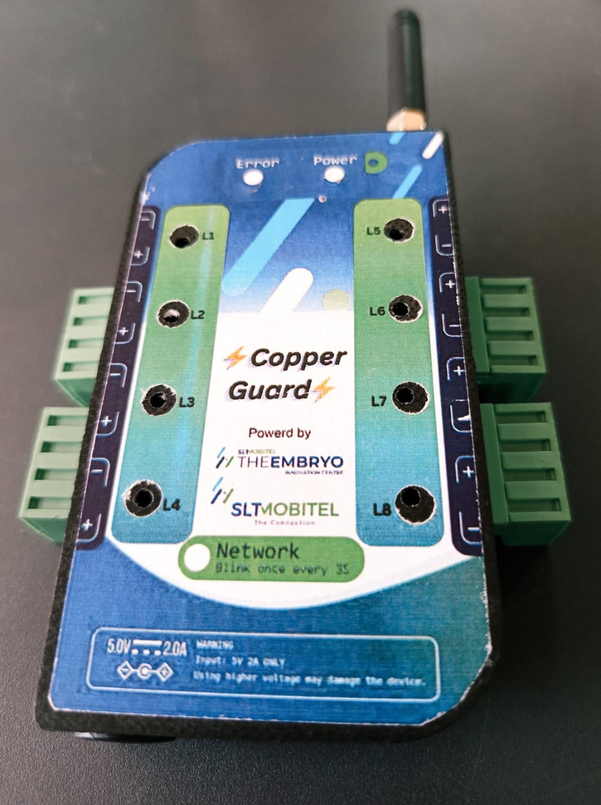
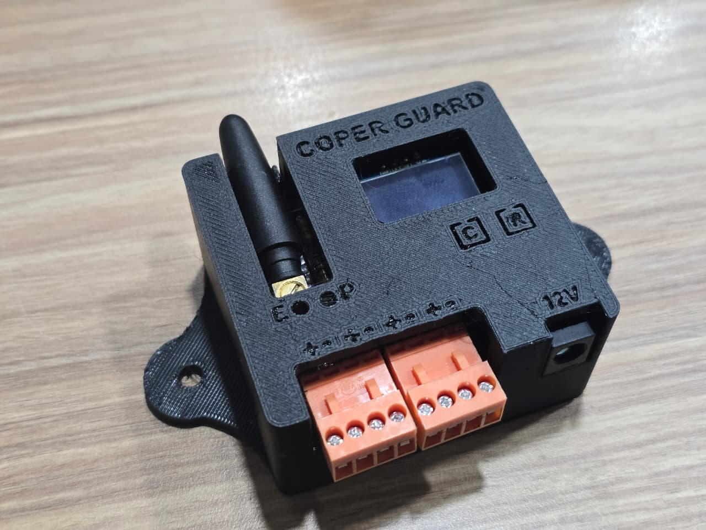

# 🛡️Copper_Guard
Copper Guard is an IoT-based copper cable protection system that detects wire cuts or failures and instantly sends SMS and call alerts using ESP12F (ESP8266) and SIM800C GSM module.

When a wire is cut or disabled:
- 📩 An SMS alert is sent
- 📞 A phone call notification is triggered

The system evolved through four hardware versions, improving scalability, connectivity, and reliability.

---

## 🚀 Versions Overview

| Version | Image | Wires Supported | Board Type | Connectivity | Deployment |
|--------|-------|-----------------|------------|--------------|------------|
| Version 1 |  | 4 | STEM Board | GSM | Prototype |
| Version 2 |  | 8 | ESP Board | GSM + WiFi | 5 devices |
| Version 3 |  | 8 | Custom PCB | GSM + WiFi | Improved |
| Version 4 |  | 4 | Custom PCB + ESP12F | GSM + WiFi + OLED | Junction |
---

## 🔧 System Features

- Wire cut detection using optocouplers
- SMS and Call alert system
- GSM communication module
- Buck converter power regulation
- WiFi connectivity (ESP versions)
- OLED display (Version 4)

---

## 📂 Branch Structure

Each version is maintained in a separate branch:

- `version1`
- `version2`
- `version3`
- `version4`

Each branch contains:
- Source code
- PCB design files
- Schematics
- Photos
- Documentation

---

## 📍 Deployment

Version 2 devices are currently deployed in the Ratnapura district.

---

## 👨‍💻 Author

Developed as part of Copper Guard Project.
